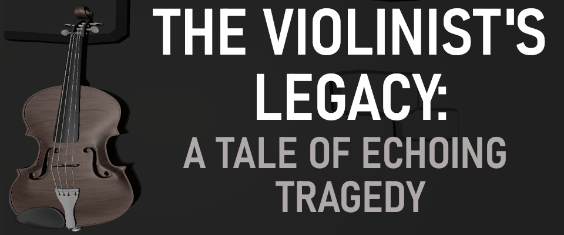
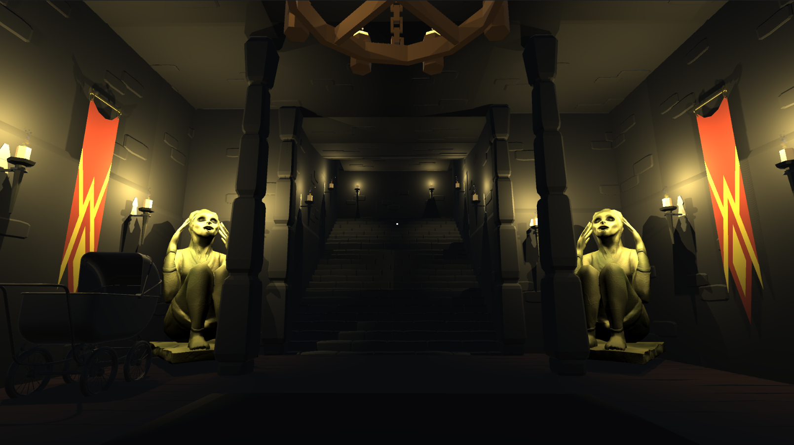
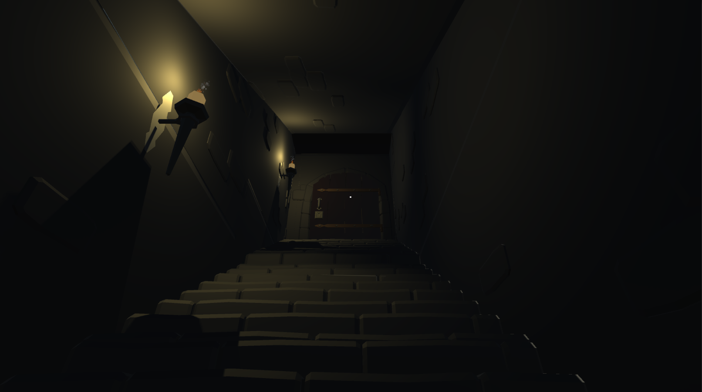
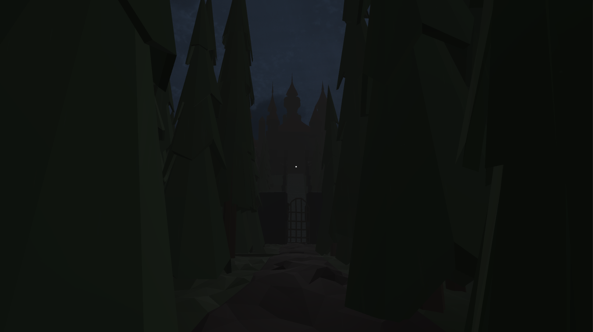
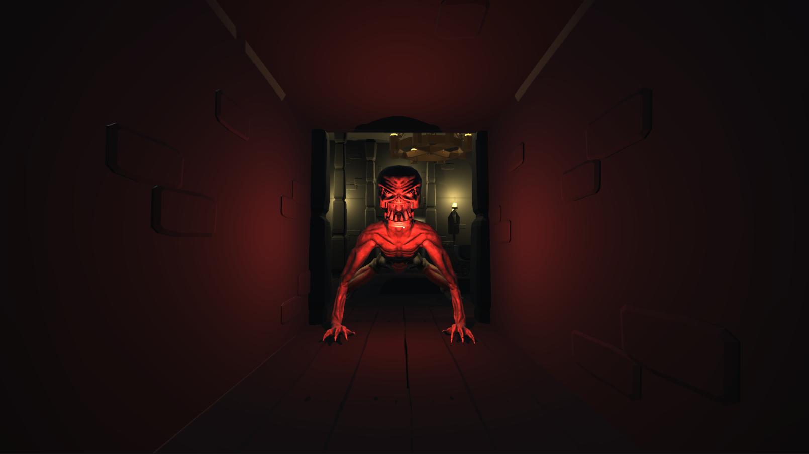
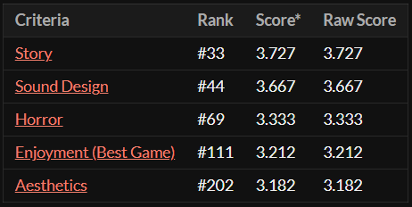
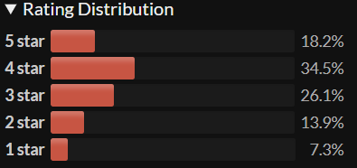

## The violinist’s legacy: a tale of echoing tragedy :skull:

### Made with C# and Unity Engine

A game we created in a week in a four-person team for ScreamJam 2023. :ghost:

<h2 align="center">Story :scroll: </h2>

Embark on a bone-chilling journey into the depths of fear with "The violinist’s legacy: a tale of echoing tragedy", a spine-tingling horror game created by amateurs - two passionate friends. In this gripping experience, you'll step into the shoes of the protagonist as they unravel a haunting narrative crafted by their imaginative friend. Dive into a world of terror and suspense, guided by a hauntingly beautiful, original music performed on the violin by a talented friend. Get ready to confront chilling tale in a game that's not just terrifying, but also a testament to the creativity and collaboration of a close-knit group of friends.

Unity Developer: Szymon Mozol, Adam Jarząbek

Writer: Zuzanna Talaga

Sound Designer: Emilia Golec

<table>
<tr>
    <td>

</td>
    <td>

</td>
</tr>
    <tr>
    <td>

</td>
    <td>

</td>
</tr>
</table>

<h2 align="center">Ratings :trophy: </h2>

About 500 games were submitted, our results are based on 33 participant votes.

<table align="center">
<tr>
    <td>

</td>
    <td>

</td>
</tr>
</table>

<h2 align="center">Download :video_game: </h2>

    Click here to download <a href="https://mozikr.itch.io/the-violonist">The violinist’s legacy: a tale of echoing tragedy</a>

